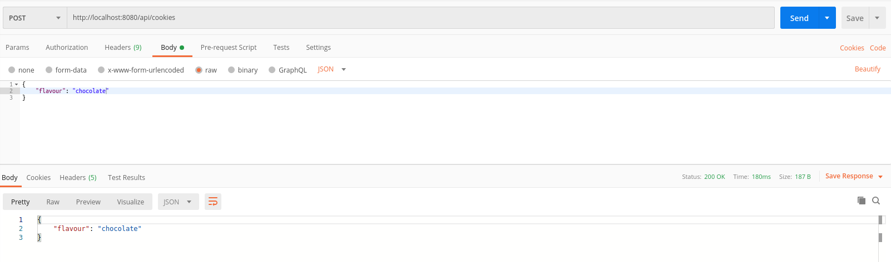

# spring-boot-postgres-flyway

[](https://keepgrowing.in)

spring-boot-postgres-flyway is a scaffolding for a web application.
It can be built into a single jar file using Maven.

If you want to build a project like this check out the following articles:
* [Set up a PostgreSQL database with Docker](https://keepgrowing.in/tools/set-up-a-postgresql-database-with-docker/)
* [Add a PostgreSQL database to your Spring Boot project](https://keepgrowing.in/java/springboot/add-a-postgresql-database-to-your-spring-boot-project/)
* [Add Flyway migrations to your Spring Boot project](https://keepgrowing.in/java/springboot/add-flyway-migrations-to-your-spring-boot-project/)

## Overview and technical features

* One endpoint enabling saving data of some baked goods (flavour).
* PostgreSQL database run from a Docker container.
* Database schema is created automatically on the application startup with a Flyway SQL-based migration.

## Getting Started

To clone this repository, execute the following in the command line:
```bash
$ git clone https://github.com/little-pinecone/spring-boot-postgres-flyway.git
```
Start the database that will be used by the app.

You can build the application with:
```bash
$ mvn clean install
```

You can run tests for the application with:
```bash
$ mvn test
```

You can send a request from Postman



## Built With

* [Spring Boot 2.2.5](https://start.spring.io/)
* [Maven](https://maven.apache.org/)
* [PostgreSQL docker image](https://hub.docker.com/_/postgres)